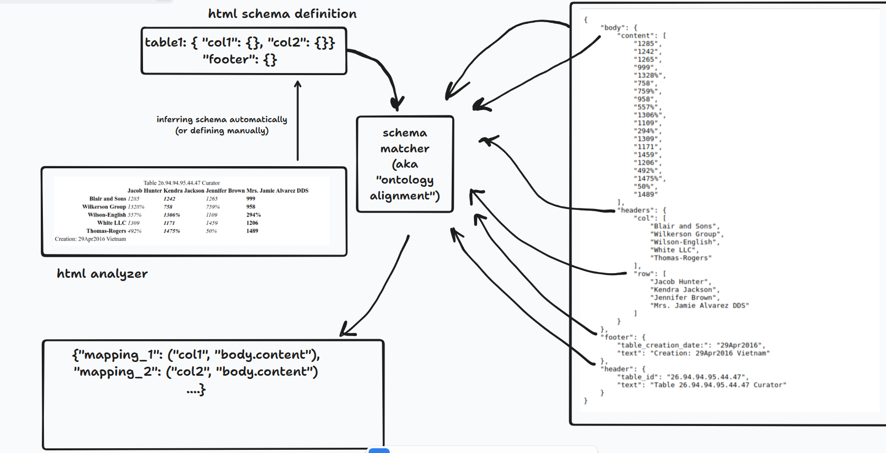

# Approach list

## 1. Approach 1: simple html parser

### 1.1. Description

According to the first observation, the tables have pretty simple structure.
In general, we need to extract:
- header
- body
- footer

And body consists of:
- content
- headers

And for most cases (can we check it? e.g. through simple table to where put tag.value vs json_property.value?) each tag value is possible to the corresponding property in the output JSON except the `Creation: <DATE> <STRING>` in html, 
which should be to be split into two properties: `footer.table_creation_date` and `footer.text`.

It's possible to build a simple html parser for this case and extract the date from the footer through the regular expression or library like [dateparser](https://github.com/scrapinghub/dateparser).

### 1.2. Pros

- It's simple to implement (if there is limited time or need to do it once , that's a good choice)
- It's fast to implement and fast to run (in "inferece" mode)

- [x] Implementation
- [x] Evaluation

### 1.3. Cons

- It's not flexible
- Easy to break
- It's possible to evaluate the performance, but it's not possible to auto-improve it (it's not trainable)
- Works only for the specific case, when we have the same structure of the tables, and for most cases, it's 1-1 mapping between html tag and JSON property

## 2. Approach 2

### 2.1. Design process and approach selection

Using NLP to extract the structure of the table and then extract the values from the table.

There are several types of the computional linguistics tasks, which can be used:
- N to 1: text classification, in our case it can be used as "rhetorical labeling task" e.g. classification of the sections of the text, which can be used to extract the structure of the html table, like {header, body, footer} but it doesn't help a lot for the case, when we need to extract the values from cells
- N to N: sequence/token classification (e.g. NER, Slot Filling, Extractive QA), in our case we can label each token in the html table with the corresponding label, e.g. {header, body, footer, row, col, value, ...}.    
For example {NER/Slot-Filling}-like tags could be obtained through "flattening" json-structure: {footer.table_creation_date, footer.text, body.content, body.headers.col, body.headers.row, ...}. 
What's need to be taken into account, is that we need to use the context information (e.g. position in the document) in order to extract the correct labels. Because for example columns values (or <td> tags) can be in the different json properties, e.g. `body.headers.col` and `body.content` (e.g. if there is no header for the column, which is mapped to first column in the html table that has "bold" font style).
Without such context information, it's not possible to extract the correct labels for models, - how we can add such features?
Usually, it's possible to add such features through the additional features, which are passed to the model, and classical CRF models use mainly such hand-crafted features. Similarly we could train LSTM-CRF model, which will use such features but
in order to simplify the solution, let's use small transformer-based model (e.g. for example encoder, like Bert) and use the position of the token in the document as the additional feature (e.g. as the additional token in the input sequence):    

```
[CLS] tokens [SEP] [FEAT_1] value [FEAT_2] value [FEAT_3] value [SEP]        
```   
where [FEAT] is the feature, for example column index, row index, etc.
 
From the experience sometimes `google/bert_uncased_L-6_H-768_A-12` is enough for NER tasks, but here we do not need to capture linguistic features or complex relations between the tokens, so it's possible to use even smaller model(or even without init from pretraining checkpoint):
so for baselines are such models will be used:        

- N to M: example of such tasks is any generative tasks (NMT, paraphrasing, etc.). it's possible to use it for the end2end model solution, where input is our html and output is the JSON, but there is the same problem with context size (so, the same is applicable as for the previous case)
But it's not hard to check such hypothesis, using for example [t5-efficient-tiny model](https://huggingface.co/google/t5-efficient-tiny)
 
For simplicity purpose, <N to M> approach is not considered further. But it's interesting to try it in the future.
<N to 1> approach in order to extract of the segments (document segmentations) is also not considered here, because we have only three parts of the document (header, body, footer), and it's easier to map them to the corresponding html tags / html nodes instead of training model for that.

So, checklist for the approach:

- [x] training "NER" extractor: `google/bert_uncased_L-6_H-768_A-12` (270mb)
- [x] training "NER" extractor: `google/bert_uncased_L-2_H-128_A-2`  (18mb)
- [x] Evaluation


### 2.2. Dataset and Labels_

### 3. Approach 3 [skipped, not implemented]

There is a way to turn the problem into schema matching problem, 


where we have two schemas: html schema and json schema, and we need to find the mapping between them.
There is a great overview and data generation tool for such task: [Matchmaker](https://github.com/matchmaker-sigmod-2021/matchmaker-sigmod-2021-main) and package [valentine](https://github.com/delftdata/valentine) for schema matching (which doesn't support vectorized representation of the data, but it's not hard to implement it).
The main problem which I see, - we do not have a real schema for the html, like even table is not really structured , because 1. it's transposed 2. it doesn't have column names and column convention   
and in that case we need firstly to implement schema inferring for the html. Which seems is overhead a bit, especially if we have implemented second approach.

But need to mention, that in case of having structured sources, it could be a best approach where need we need to find mappings between sets of the metadata definitions, example:
```
"source_1" : {
  { "name": "id", "type": "int" },
  { "name": "name", "type": "string" },
  { "name": "age", "type": "int" , "min": 0, "max": 100, "mean": 50, "mode": 39},
}

"source_2" : {
  { "name": "id", "type": "int" },
  { "name": "fullname", "type": "string" },
  { "name": "age", "type": "int" , "min": 0, "max": 100, "mean": 50, "mode": 35},
}
```
where we could encode our stats (and even distribution) and after that we need to apply similarly to deduplication/record linkage task, - to find the mapping between the schemas (for simple cases, when we have 1-1 mapping, it turns to linear assignment problem, which is easy to solve).
and it's possible to apply the similar techniques, like "blocking"(pruning/reducing the search space of the possible pairwise matches which is equals to the cartesian product of the sets of the columns) and "matching" (finding the best match between the pairs of the columns, such as training biencoder or crossencoder model, where we could encode additional features like it was shown in the previous approach).
I have experience with such tasks but decided to skip it for now, because it seems that other approaches are more suitable for the current task.

### 4. Evaluation and criteria of success